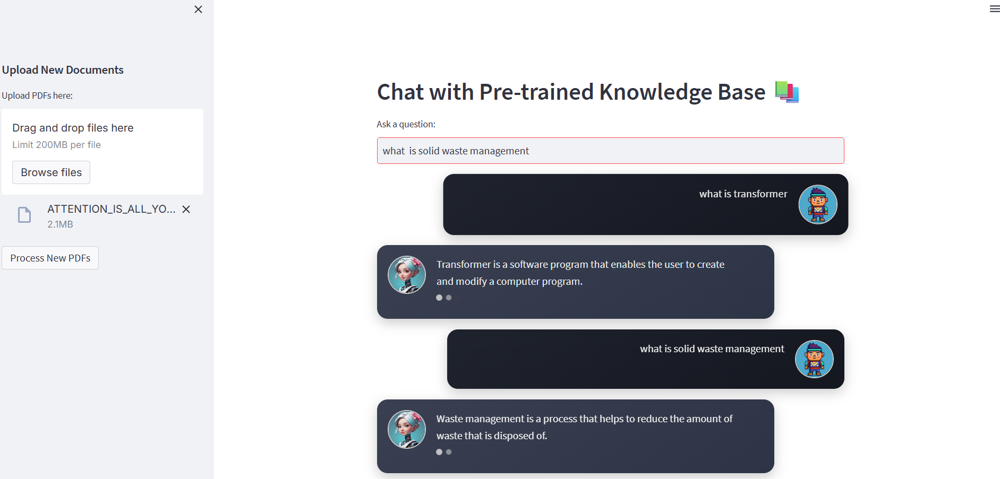

# 💬 AI Chatbot with Custom Knowledge Base and PDF Question Answering
This project is an advanced chatbot system that combines a pretrained knowledge base, custom user documents (PDFs), and the power of OpenAI's language models to deliver accurate, context-aware answers.

# 📚 Key Features
Pretrained Knowledge Base
The chatbot is initialized with a built-in knowledge base containing essential data for quick and efficient responses.

Dynamic PDF Ingestion
Users can upload their own PDF documents. The chatbot extracts text from these PDFs and uses it to answer questions contextually.

Intelligent Answer Selection

If an answer is available in the knowledge base or PDF content, it is retrieved and returned.

If not, the chatbot seamlessly queries OpenAI's API (e.g., GPT) to provide the best possible answer.

User-Friendly Interface
A simple and intuitive interface allows easy interaction with the chatbot and uploading of documents.

# 🚀 How It Works
Initialization: Loads a pretrained set of pdf into memory.

User Upload: Accepts PDF documents and parses the content into a searchable format.

Query Handling:

Searches the knowledge base + parsed PDF content.

If a match is found, the answer is returned.

If not found, the question is passed to the OpenAI API for generation.

📷 Demo Screenshot

✅ Benefits
Combines static and dynamic knowledge sources

Gives fast, reliable answers with fallback to OpenAI

Easily extensible with more documents or domains

Perfect for research, education, and business intelligence

